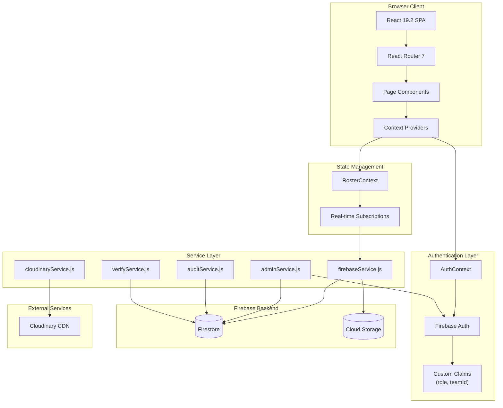
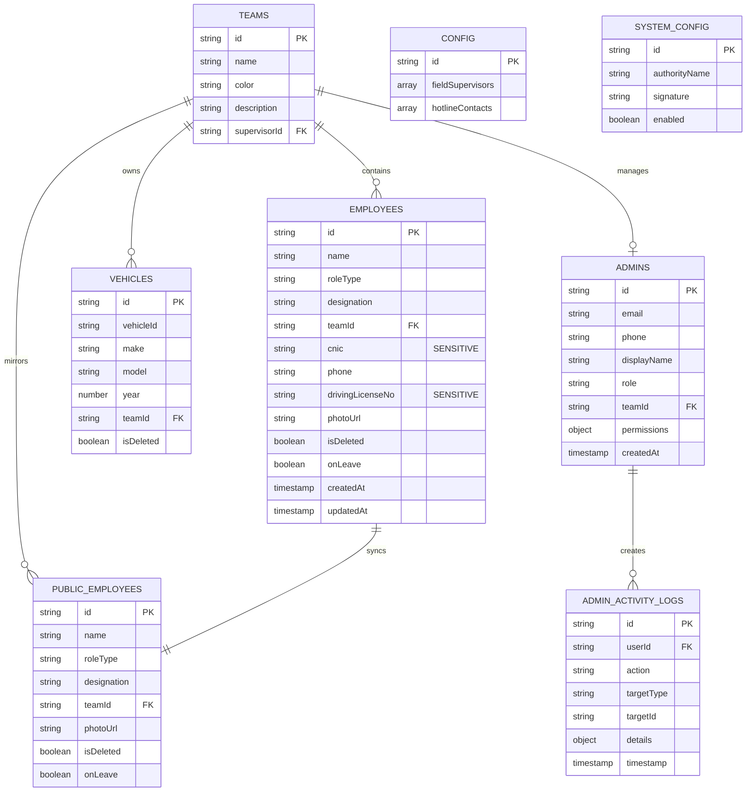
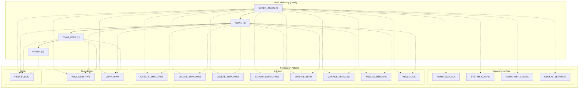
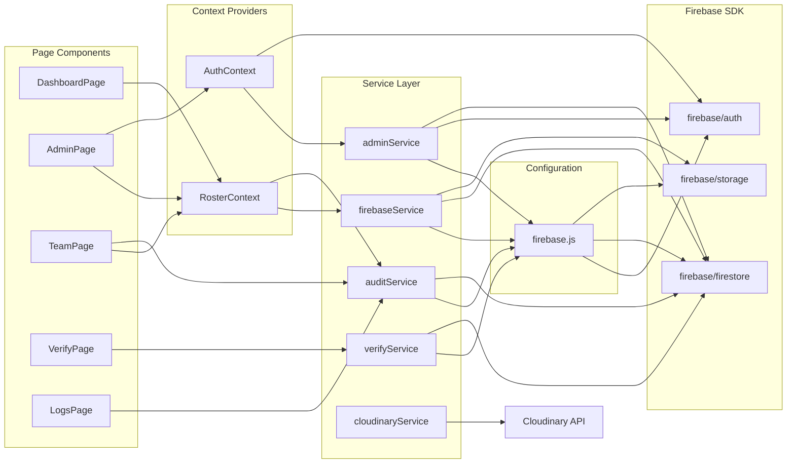
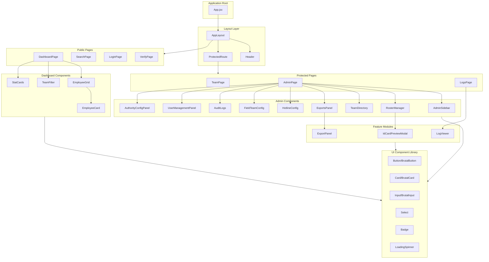
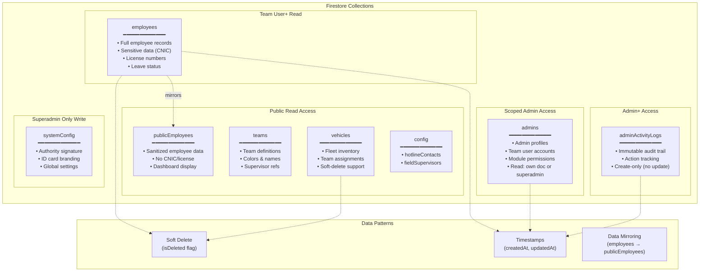
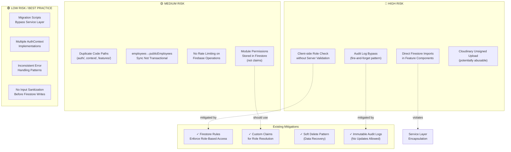

# FoneRoster Architectural Review

**Generated:** June 2025  
**Status:** Pre-Refactor Analysis  
**Scope:** Full system architecture, data model, security, and refactoring recommendations

---

## Table of Contents

1. [System Architecture Overview](#1-system-architecture-overview)
2. [Firebase Data Model](#2-firebase-data-model)
3. [Role-Based Permission Map](#3-role-based-permission-map)
4. [Service Dependency Graph](#4-service-dependency-graph)
5. [React Component Hierarchy](#5-react-component-hierarchy)
6. [Firestore Collection Structure](#6-firestore-collection-structure)
7. [Security Risk Map](#7-security-risk-map)
8. [Refactoring Plan](#8-refactoring-plan)

---

## 1. System Architecture Overview



### Architecture Summary

| Layer | Technology | Purpose |
|-------|-----------|---------|
| **Client** | React 19.2, Vite 7 | SPA with lazy-loaded routes |
| **Routing** | React Router 7 | Declarative navigation, protected routes |
| **State** | Context API | AuthContext (auth), RosterContext (data) |
| **Services** | Custom service layer | Firestore abstraction, audit logging |
| **Backend** | Firebase 12.9 | Auth, Firestore, Cloud Storage |
| **CDN** | Cloudinary | Image upload and optimization |
| **Styling** | Tailwind CSS 3.4 | Brutalist design system |

---

## 2. Firebase Data Model



### Data Model Notes

| Collection | Records | Sensitive Fields | Access Level |
|-----------|---------|-----------------|--------------|
| `employees` | Full records | CNIC, license | Team User+ |
| `publicEmployees` | Sanitized | None | Public |
| `teams` | Team definitions | None | Public |
| `vehicles` | Fleet data | None | Public |
| `admins` | User profiles | Phone, permissions | Scoped |
| `config` | App config | None | Public read |
| `systemConfig` | Authority data | Signature | Auth only |
| `adminActivityLogs` | Audit trail | None | Admin read |

---

## 3. Role-Based Permission Map



### Permission Matrix

| Action | Public | Team User | Admin | Superadmin |
|--------|--------|-----------|-------|------------|
| VIEW_PUBLIC | ✅ | ✅ | ✅ | ✅ |
| VIEW_TEAM | ❌ | ✅ | ✅ | ✅ |
| VIEW_SENSITIVE | ❌ | ✅ | ✅ | ✅ |
| VIEW_DASHBOARD | ❌ | ❌ | ✅ | ✅ |
| VIEW_LOGS | ❌ | ❌ | ✅ | ✅ |
| CREATE_EMPLOYEE | ❌ | ❌ | ✅ | ✅ |
| UPDATE_EMPLOYEE | ❌ | ❌ | ✅ | ✅ |
| DELETE_EMPLOYEE | ❌ | ❌ | ✅ | ✅ |
| EXPORT_EMPLOYEES | ❌ | ❌ | ✅ | ✅ |
| MANAGE_TEAM | ❌ | ❌ | ✅ | ✅ |
| MANAGE_VEHICLES | ❌ | ❌ | ✅ | ✅ |
| ADMIN_MANAGE | ❌ | ❌ | ❌ | ✅ |
| SYSTEM_CONFIG | ❌ | ❌ | ❌ | ✅ |
| AUTHORITY_CONFIG | ❌ | ❌ | ❌ | ✅ |
| GLOBAL_SETTINGS | ❌ | ❌ | ❌ | ✅ |

---

## 4. Service Dependency Graph



### Service Layer Summary

| Service | Purpose | Dependencies |
|---------|---------|--------------|
| `firebaseService.js` | CRUD operations for employees, teams, vehicles, config | Firestore, Storage |
| `adminService.js` | Admin user management, secondary app pattern | Auth, Firestore |
| `auditService.js` | Activity logging, immutable audit trail | Firestore |
| `verifyService.js` | Public employee verification | Firestore |
| `cloudinaryService.js` | Image upload with client-side resize | Cloudinary API |

---

## 5. React Component Hierarchy



### Component Organization Issues

| Issue | Location | Impact |
|-------|----------|--------|
| Duplicate AuthContext | `src/auth/`, `src/context/`, `src/features/auth/` | Confusion, maintenance burden |
| Duplicate LoginForm | `src/auth/`, `src/features/auth/` | Inconsistent behavior |
| Duplicate Header | `src/components/`, `src/components/layout/` | Style drift |
| Legacy pages | `src/pages/` alongside `src/*/pages/` | Unclear ownership |

---

## 6. Firestore Collection Structure



### Firestore Security Rules Summary

| Collection | Read | Write | Notes |
|-----------|------|-------|-------|
| `publicEmployees` | Anyone | Admin+ | Sanitized data |
| `employees` | Team User+ | Admin+ | Full records |
| `teams` | Anyone | Admin+ | Team definitions |
| `vehicles` | Anyone | Admin+ | Fleet data |
| `config` | Anyone | Admin+ | App configuration |
| `admins` | Scoped | Superadmin | Own doc or superadmin |
| `systemConfig` | Authenticated | Superadmin | Authority settings |
| `adminActivityLogs` | Admin+ | Create only | Immutable audit |

---

## 7. Security Risk Map



### Security Risk Details

#### 🔴 High Risk Issues

| Risk | Description | Recommendation |
|------|-------------|----------------|
| **Direct Firestore Imports** | `features/audit/AuditLogViewer.jsx` imports Firestore directly, bypassing service layer | Route all Firestore access through services |
| **Audit Log Bypass** | Fire-and-forget pattern means failed logs are silently lost | Add retry logic or queue failed logs |
| **Client-side Role Checks** | `hasPermission()` runs client-side without server validation | Always enforce in Firestore rules (already done) |
| **Unsigned Cloudinary Upload** | Public unsigned upload preset could be abused | Consider signed uploads or rate limiting |

#### 🟡 Medium Risk Issues

| Risk | Description | Recommendation |
|------|-------------|----------------|
| **Duplicate Code Paths** | Auth logic scattered across 3+ directories | Consolidate to single source of truth |
| **Non-transactional Sync** | `employees` → `publicEmployees` can fail partially | Use Firestore batch or transaction |
| **No Rate Limiting** | No client-side throttling on Firestore operations | Add debouncing/throttling hooks |
| **Module Permissions in Firestore** | Granular permissions in `admins` doc instead of claims | Consider moving critical permissions to claims |

---

## 8. Refactoring Plan

### Phase 1: Code Consolidation (Low Risk)

**Goal:** Eliminate duplicate code and establish single sources of truth

| Task | Files Affected | Priority |
|------|---------------|----------|
| Consolidate AuthContext | Remove `src/context/AuthContext.jsx`, `src/features/auth/AuthContext.jsx`. Keep `src/auth/AuthContext.jsx` | High |
| Consolidate LoginForm | Remove `src/features/auth/LoginForm.jsx`. Keep `src/auth/LoginForm.jsx` | High |
| Consolidate Header | Remove `src/components/Header.jsx`. Keep `src/components/layout/Header.jsx` | Medium |
| Migrate legacy pages | Move `src/pages/*` to feature-based structure | Medium |
| Remove unused components | Audit and remove dead code in `src/admin/components/` | Low |

**Estimated Impact:** ~15 files, no functionality change

---

### Phase 2: Service Layer Enforcement (Medium Risk)

**Goal:** Route all Firestore access through service layer

| Task | Current State | Target State |
|------|--------------|--------------|
| `AuditLogViewer.jsx` | Direct Firestore import | Use `auditLogService` |
| `migrate_*.js` scripts | Direct Firestore import | Acceptable for one-time migrations |
| Add service layer tests | No tests | Unit tests for critical services |

**Files to Refactor:**
- `src/features/audit/AuditLogViewer.jsx` - Add to `firebaseService.js`

---

### Phase 3: Auth System Improvements (Medium Risk)

**Goal:** Strengthen authentication and authorization

| Task | Description | Benefit |
|------|-------------|---------|
| Add token refresh handling | Implement graceful re-auth on token expiry | Better UX |
| Move module permissions to claims | Currently in Firestore `admins` doc | Faster permission checks |
| Add session timeout | Auto-logout after inactivity | Security |
| Implement MFA (optional) | Firebase supports TOTP and SMS | Enhanced security |

**Implementation Notes:**
- Token refresh requires intercepting 401s and prompting re-auth
- Moving permissions to claims requires Cloud Function to update claims on permission change

---

### Phase 4: Data Layer Improvements (Medium-High Risk)

**Goal:** Improve data consistency and integrity

| Task | Current State | Target State |
|------|--------------|--------------|
| Transactional sync | `employees` → `publicEmployees` can fail partially | Firestore batch writes |
| Input validation | Basic client-side | Add Zod schemas with server validation |
| Audit log reliability | Fire-and-forget | Add retry queue for failed logs |
| Optimistic updates | Full re-fetch after mutations | Local state updates with rollback |

**Service Changes Required:**
```javascript
// firebaseService.js - Example transactional sync
async updateEmployee(id, data) {
  const batch = writeBatch(db);
  batch.update(doc(db, 'employees', id), data);
  batch.update(doc(db, 'publicEmployees', id), sanitize(data));
  await batch.commit();
}
```

---

### Phase 5: Component Architecture (Low-Medium Risk)

**Goal:** Establish clear component hierarchy and patterns

| Task | Description |
|------|-------------|
| Create component index files | Export all public components from `index.js` |
| Standardize prop interfaces | Use TypeScript or PropTypes consistently |
| Extract shared hooks | Move reusable logic to `src/hooks/` |
| Document UI component library | Add Storybook or similar |

**Proposed Directory Structure:**
```
src/
├── app/                    # App shell, routing, layout
├── auth/                   # Single auth source of truth
├── components/
│   ├── ui/                 # Primitive components (Button, Input, etc.)
│   └── layout/             # Layout components (Header, Sidebar)
├── features/
│   ├── admin/              # Admin dashboard features
│   ├── dashboard/          # Public dashboard
│   ├── directory/          # Employee directory
│   └── roster/             # Roster management
├── hooks/                  # Shared custom hooks
├── services/               # All Firestore/API access
├── lib/                    # Utilities, constants, types
└── config/                 # Environment config
```

---

### Phase 6: Performance Optimization (Low Risk)

**Goal:** Improve load times and runtime performance

| Task | Current State | Target State |
|------|--------------|--------------|
| Subscription cleanup | Manual cleanup in useEffect | Custom hook with automatic cleanup |
| Memoization | Inconsistent | Use `useMemo`/`useCallback` for expensive ops |
| Bundle analysis | Not tracked | Add bundle analyzer to build |
| Image optimization | Client-side resize | Consider server-side with Cloudinary transforms |

---

### Refactoring Priority Matrix

```
                    LOW RISK ←→ HIGH RISK
                    ↓                   ↓
HIGH VALUE    [Phase 1]          [Phase 4]
    ↑         Code               Data Layer
    |         Consolidation      Improvements
    |
    |         [Phase 2]          [Phase 3]
    |         Service Layer      Auth System
    ↓         Enforcement        Improvements
LOW VALUE
              [Phase 6]          [Phase 5]
              Performance        Component
              Optimization       Architecture
```

**Recommended Order:** Phase 1 → Phase 2 → Phase 3 → Phase 4 → Phase 5 → Phase 6

---

### Migration Checklist

Before starting any phase:
- [ ] Create feature branch
- [ ] Run existing tests (if any)
- [ ] Document current behavior

After completing each phase:
- [ ] Manual QA of affected features
- [ ] Update this document
- [ ] Create PR with clear scope

---

## Appendix: File Dependencies

### Files with Direct Firestore Imports (Outside Services)

| File | Import | Should Use |
|------|--------|------------|
| `src/features/audit/AuditLogViewer.jsx` | `firebase/firestore` | `auditLogService` |
| `src/utils/migrate_isDeleted.js` | `firebase/firestore` | OK (migration script) |
| `src/utils/migrateUsersToEmployees.js` | `firebase/firestore` | OK (migration script) |
| `src/utils/migrateEmployeesToPublic.js` | `firebase/firestore` | OK (migration script) |
| `src/scripts/*.js` | `firebase/firestore` | OK (one-time scripts) |

### Duplicate File Map

| Canonical Location | Duplicates to Remove |
|-------------------|---------------------|
| `src/auth/AuthContext.jsx` | `src/context/AuthContext.jsx` |
| `src/auth/LoginForm.jsx` | `src/features/auth/LoginForm.jsx` |
| `src/auth/ProtectedRoute.jsx` | `src/components/layout/ProtectedRoute.jsx` |
| `src/components/layout/Header.jsx` | `src/components/Header.jsx` |

---

*This document should be updated as refactoring progresses.*
