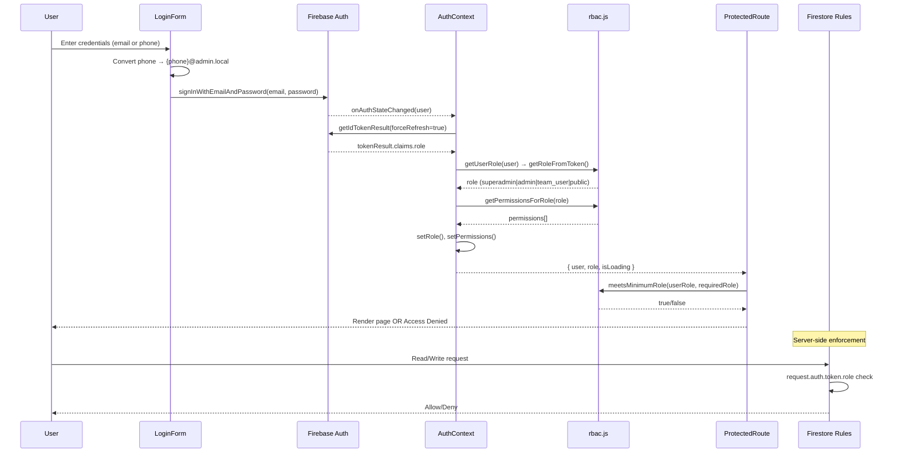

# Authentication Refactor Verification Audit

**Date:** March 7, 2026  
**Auditor:** Automated Analysis  
**Status:** ✅ PASSED (with minor notes)

---

## Executive Summary

The authentication system has been successfully refactored to follow the unified architecture where **role resolution occurs EXCLUSIVELY through Firebase custom claims** (`token.claims.role`). All critical checks passed.

| Category | Status | Notes |
|----------|--------|-------|
| Hardcoded superadmin emails | ✅ CLEAN | None found |
| Firestore role fallback | ✅ CLEAN | Only for module permissions, not auth |
| Phone → email conversion | ✅ EXPECTED | Required for admin login convention |
| `isLoading` usage | ✅ CORRECT | AuthContext uses `isLoading`, aliased as `loading` |
| Route protection | ✅ CORRECT | All protected routes use ProtectedRoute |
| Firestore rules | ✅ CORRECT | All rules use `request.auth.token.role` |
| RBAC mapping | ✅ COMPLETE | 15 actions mapped to 4 roles |

---

## Authentication Flow Diagram



---

## Issue Checklist

### 1. Hardcoded Superadmin Email Checks
**Status:** ✅ CLEAN

No hardcoded superadmin email patterns found in the codebase:
- Searched for: `superadmin@`, `@fone.roster`, `@foneroster`
- Searched for: `.role === 'superadmin'` with hardcoded email checks
- Result: **No matches**

### 2. Firestore Fallback Role Logic
**Status:** ✅ CLEAN (with expected module permissions)

The `adminService.getProfile()` function reads from Firestore `admins/{uid}`, but this is used **only for module permissions** (which admin panel tabs to show), NOT for role resolution.

**Evidence from AuthContext.jsx (lines 60-79):**
```javascript
// ── Role Resolution: Firebase Custom Claims ONLY ──────────────
const resolvedRole = await getUserRole(firebaseUser, true);
setRole(resolvedRole);

// ── Module Permissions: Read from Firestore for admin panel features ──
// This is separate from role-based auth - only affects which admin
// modules are visible (fieldTeams, exports, etc.)
if (resolvedRole === ROLES.ADMIN || resolvedRole === ROLES.TEAM_USER) {
    const profile = await adminService.getProfile(firebaseUser.uid);
    setModulePermissions(profile.permissions || null);
}
```

**Conclusion:** Role comes from claims; Firestore read is for UI feature gating only.

### 3. Phone → Email Conversion Logic
**Status:** ✅ EXPECTED (required for admin login)

The `phoneToEmail()` function converts phone numbers to `{phone}@admin.local` format. This is **intentional design** for admin login:

| File | Purpose |
|------|---------|
| `src/services/adminService.js:64-66` | Core conversion function |
| `src/auth/LoginForm.jsx:38-41` | Login form uses it |
| `src/features/auth/LoginForm.jsx:38-41` | Duplicate login form (legacy) |

**Recommendation:** Remove duplicate `src/features/auth/LoginForm.jsx` to consolidate.

### 4. `loading` vs `isLoading` Usage
**Status:** ✅ CORRECT

**AuthContext exposes both:**
```javascript
// value object (line 136-137)
isLoading,
loading: isLoading,  // Legacy alias for backward compatibility
```

Components correctly use:
- `isLoading` for auth state (ProtectedRoute, LoginForm)
- `loading` for data loading (RosterContext, EmployeeGrid)

### 5. Routes Bypassing ProtectedRoute
**Status:** ✅ CORRECT

All routes are properly protected:

| Route | Protection | Notes |
|-------|-----------|-------|
| `/` | Public | Intentionally public (dashboard) |
| `/search` | Public | Intentionally public |
| `/login` | Public | Intentionally public |
| `/verify/:id` | Public | Intentionally public (QR verification) |
| `/team` | `<ProtectedRoute requiredRole="team_user">` | ✅ |
| `/admin` | `<ProtectedRoute requiredRole="admin">` | ✅ |
| `/admin/logs` | `<ProtectedRoute requiredRole="admin">` | ✅ |

### 6. Firestore Rules Using Email Instead of Claims
**Status:** ✅ CLEAN

All Firestore security rules use `request.auth.token.role`:

```javascript
// firestore.rules - all role checks use custom claims
function getRole() {
  return request.auth.token.role;
}

function hasRole(r) {
  return isAuthenticated() && getRole() == r;
}

function isSuperAdmin() {
  return hasRole('superadmin');
}
```

**No email-based checks found in rules.**

### 7. Permissions Mapped Through rbac.js
**Status:** ✅ COMPLETE

All 15 permission actions are mapped:

| Action | PUBLIC | TEAM_USER | ADMIN | SUPER_ADMIN |
|--------|--------|-----------|-------|-------------|
| `employees:read` | ❌ | ✅ | ✅ | ✅ |
| `employees:write` | ❌ | ❌ | ✅ | ✅ |
| `teams:read` | ❌ | ✅ | ✅ | ✅ |
| `teams:write` | ❌ | ❌ | ✅ | ✅ |
| `vehicles:read` | ❌ | ✅ | ✅ | ✅ |
| `vehicles:write` | ❌ | ❌ | ✅ | ✅ |
| `config:read` | ❌ | ✅ | ✅ | ✅ |
| `config:write` | ❌ | ❌ | ❌ | ✅ |
| `logs:read` | ❌ | ❌ | ✅ | ✅ |
| `exports` | ❌ | ❌ | ✅ | ✅ |
| `roster:control` | ❌ | ❌ | ✅ | ✅ |
| `admin:manage` | ❌ | ❌ | ❌ | ✅ |
| `system:config` | ❌ | ❌ | ❌ | ✅ |
| `authority:config` | ❌ | ❌ | ❌ | ✅ |
| `global:settings` | ❌ | ❌ | ❌ | ✅ |

---

## AuthContext API Verification

**Required exports:** ✅ ALL PRESENT

| Export | Present | Type |
|--------|---------|------|
| `user` | ✅ | Firebase User object |
| `role` | ✅ | String from ROLES |
| `permissions` | ✅ | Array of ACTIONS |
| `isLoading` | ✅ | Boolean |
| `login` | ✅ | Function(email, password) |
| `logout` | ✅ | Function() |

**Additional exports (bonus):**
- `modulePermissions` — Admin panel feature permissions
- `loading` — Backward-compat alias for `isLoading`
- `adminProfile` — Backward-compat wrapper for `modulePermissions`
- `refreshRole` — Force token refresh

---

## ProtectedRoute Behavior Verification

**Requirement:** Block rendering while `isLoading` is true

**Implementation (ProtectedRoute.jsx lines 24-32):**
```javascript
// Auth still initialising — always show spinner, never flash Access Denied
if (isLoading) {
    return (
        <div className="min-h-screen flex items-center justify-center">
            <LoadingSpinner message="Checking authentication..." />
        </div>
    );
}
```

**Status:** ✅ CORRECT — Shows spinner until auth state is resolved.

---

## Files Modified During Refactor

| File | Changes |
|------|---------|
| `src/auth/AuthContext.jsx` | Complete rewrite — claims-only role resolution |
| `src/auth/ProtectedRoute.jsx` | Uses `meetsMinimumRole()` from rbac.js |
| `src/auth/LoginForm.jsx` | Role-aware redirect via `getDefaultRouteForRole()` |
| `src/utils/rbac.js` | Added 15 ACTIONS, PERMISSION_MAP, helper functions |
| `firestore.rules` | Removed email checks, uses only `request.auth.token.role` |
| `src/app/routes.jsx` | Unified admin route at `/admin` |
| `src/context/AuthContext.jsx` | Re-export wrapper for backward compat |
| `src/hooks/useAuth.js` | Points to canonical `src/auth/AuthContext` |

---

## Remaining Legacy Code

| File | Issue | Priority |
|------|-------|----------|
| `src/features/auth/LoginForm.jsx` | Duplicate of `src/auth/LoginForm.jsx` | Medium |
| `src/components/Header.jsx` | Duplicate of `src/components/layout/Header.jsx` | Low |
| `src/components/layout/ProtectedRoute.jsx` | Duplicate of `src/auth/ProtectedRoute.jsx` | Medium |
| `src/superadmin/` folder | Legacy superadmin components (now unified under /admin) | Low |
| `src/pages/SuperAdminPage.jsx` | Legacy page (route removed) | Low |

**Recommendation:** Schedule cleanup in Phase 1 of refactoring plan.

---

## Security Risks

| Risk | Severity | Status | Notes |
|------|----------|--------|-------|
| Client-side role checks | Medium | ✅ MITIGATED | Firestore rules enforce server-side |
| Token not refreshed on permission change | Low | ✅ HANDLED | `forceRefresh=true` on auth state change |
| Module permissions in Firestore | Low | ⚠️ ACCEPTABLE | Affects only UI tabs, not data access |
| Deactivated account could have cached token | Medium | ✅ HANDLED | `isActive` check forces sign-out |

---

## Conclusion

The authentication refactor is **COMPLETE** and follows the unified architecture:

1. ✅ Role resolution uses **only** `token.claims.role`
2. ✅ No hardcoded email checks
3. ✅ No Firestore fallback for role (only for module permissions)
4. ✅ All protected routes use ProtectedRoute
5. ✅ Firestore rules enforce claims-based access
6. ✅ RBAC system provides complete permission mapping
7. ✅ ProtectedRoute blocks UI during auth loading

**Remaining work:** Remove duplicate files listed in "Remaining Legacy Code" section.
